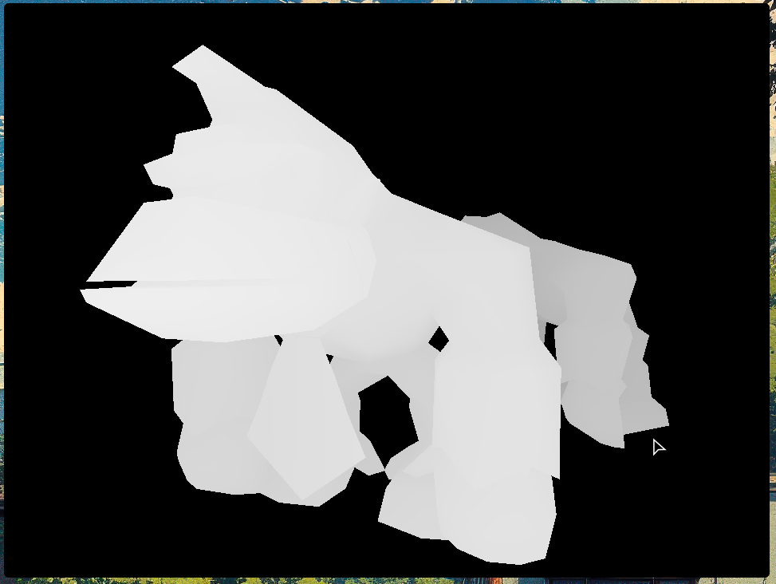

A systems programming experiment. A duck-taped together, free-standing, simd accelerated, multi-threaded software 3d rasterizer on linux/wayland

Implements, among other things:
- Raw assembly syscalls into the linux kernel
- Fork/join multi-threading
- Width abstracted simd
- Manually speaking the wayland protocol
- Bare-minimum simd accelerated affine & vector math
- And, of course, a terrible software 3d rasterizer that renders two spinning instances of the embedded model.

Just renders a depth buffer of the embedded model as fast as possible. (Which is not terribly fast.)
There's no proper shading, vertical sync, no model loading, and basically nothing else really.

It Works on My Machine (TM), and I have made no attempt to make it work on other machines.

Renders somewhere around 90fps at 960x720 with 4 threads on my pc.

Some of the code is good. Most of it probably isn't.

The most interesting part is `app.c`, which is where the rasterizer is.

Strict requirements:
	linux, x86_64, wayland

